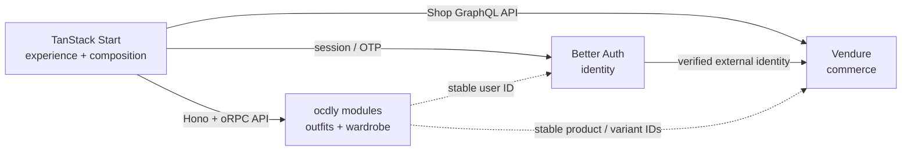

# ADR 0001: Platform and domain boundaries

- **Status:** Accepted
- **Date:** 2026-09-18
- **Decision owner:** ocdly
- **Roadmap phase:** T0
- **Source:** [Technology Plan v1](../plans/ocdly-tech-plan-v1.md)

## Context

ocdly needs commodity commerce capabilities without turning the storefront or
future styling products into extensions of a commerce platform. The first
release is men's T-shirts, but the product direction includes editorial
outfits, saved looks and a digital wardrobe. Those experiences have a longer
lifetime than any individual commerce or identity provider.

The architecture therefore needs explicit ownership and dependencies before a
real catalogue is connected in T1.

## Decision

The system has four primary boundaries:

1. **TanStack Start owns the customer experience.** It renders storefront,
   editorial and account journeys and composes data from the other domains. It
   is not a commerce source of truth.
2. **Vendure owns commerce.** Its Shop/Admin APIs and PostgreSQL data own the
   sellable catalogue, variants, inventory, pricing, promotions, carts,
   orders, payments, fulfillment and commerce-customer records.
3. **Better Auth owns application identity.** Phone number plus OTP is the
   primary login. Email is secondary. A verified Better Auth identity maps to
   a Vendure Customer through an external authentication strategy; neither
   system silently becomes the other's source of truth.
4. **ocdly application modules own outfits and wardrobe.** These modules own
   editorial outfits, external pieces, saved looks and—later—digital wardrobe
   data. They may reference stable commerce and identity IDs, but Vendure does
   not absorb these domains.

## Ownership table

| Capability/data | System of record | Consumers | Notes |
| --- | --- | --- | --- |
| Storefront UI, routing and interaction | TanStack Start | Shopper | Presentation and orchestration only |
| Product, variant and SKU | Vendure | Storefront, outfit module | Includes public catalogue fields needed to sell |
| Price, promotion and tax calculation | Vendure | Storefront, checkout | Client-supplied totals are never authoritative |
| Inventory and preorder capacity | Vendure | Storefront, operations | No duplicate app-level stock counter |
| Cart and order lifecycle | Vendure | Storefront, operations | Vendure state is authoritative |
| Payment and refund state | Vendure integration/plugin | Storefront, operations | Provider callbacks must be verified and idempotent |
| Fulfillment and commerce addresses | Vendure | Storefront, operations | Delhivery is manual initially |
| Login identity and session | Better Auth | Storefront, app modules, Vendure bridge | Phone/OTP primary; email secondary |
| Commerce customer | Vendure | Commerce flows | Linked to—but distinct from—the Better Auth user |
| Editorial outfit/look | ocdly application module | Storefront | May mix internal and external pieces |
| External outfit item | ocdly application module | Storefront | Never represented as a fake Vendure SKU |
| Saved outfits and follows/likes | ocdly application module | Storefront | Keyed to the Better Auth user ID |
| Digital wardrobe | ocdly application module | Storefront | Boundary reserved; implementation deferred |
| Media assets | S3-compatible object storage | All surfaces | Cloudflare R2 is the current preference |

## Dependency rules

1. Storefront route/components do not query commerce or identity databases.
   They use explicit APIs or server-side adapters.
2. Vendure is accessed through its Shop/Admin GraphQL APIs. Vendure backend
   modules are not imported into the TanStack application.
3. Better Auth credentials, OTPs and application sessions never live in
   Vendure. Vendure stores only the external identity link needed for its
   Customer/session.
4. Outfit and wardrobe modules reference opaque Better Auth user IDs and
   Vendure product/variant IDs. They do not join directly across provider
   schemas or copy authoritative price, inventory or identity state.
5. External products in outfits remain editorial links with disclosure and
   source metadata. They do not enter the ocdly cart.
6. Cashfree and future payment providers integrate behind a Vendure payment
   adapter/plugin. Payment truth comes from signed server-side verification,
   not browser state.
7. Shipping automation integrates behind a Vendure fulfillment boundary.
   Manual Delhivery One operations are acceptable until volume earns the
   integration.
8. Shared UI/query models are intentionally narrower than provider schemas.
   Provider-specific fields stay in adapters so replacing a provider does not
   require rewriting the experience layer.
9. Cross-domain changes use APIs or explicit events. Shared database tables
   and cross-schema joins are not integration contracts.
10. A new service or abstraction must solve an observed customer or operations
    problem; anticipated scale alone is not sufficient.

## Initial integration contracts

T1 may introduce only the minimum contract needed for a real catalogue:

- a server-side Vendure Shop API client;
- a storefront-facing catalogue model mapped from Vendure responses;
- catalogue queries for collection/product lists and product detail;
- stable loading, empty and failure states; and
- local fixture/seed data owned by the Vendure development environment.

Authentication, active-order cart mutation, Cashfree checkout and shipping are
later roadmap phases. T1 must not smuggle them in through the catalogue client.

## Consequences

### Benefits

- The distinctive storefront can evolve independently of the commerce engine.
- Standard commerce behavior stays in a system designed to own it.
- Phone-first identity can support purchasing and non-commerce products.
- Outfit/wardrobe work can include external fashion without corrupting the
  sellable catalogue.
- Vendure remains replaceable because the experience consumes a narrow mapped
  contract rather than provider internals.

### Costs and trade-offs

- Customer identity requires an explicit Better Auth-to-Vendure bridge.
- The storefront needs mapping code between GraphQL responses and its view
  model.
- Cross-domain workflows require clear IDs, APIs and eventual event handling.
- Two PostgreSQL-backed domains may exist later; operational convenience does
  not make their schemas a shared contract.

## Deferred scope

T0 and T1 do **not** include Better Auth phone OTP, the identity-to-customer
bridge, Vendure cart/order mutation, Cashfree, FlowWise, automated Delhivery,
COD risk scoring, outfit implementation, digital wardrobe, AI styling,
recommendations, loyalty, advanced search, multi-warehouse, international
commerce, microservices/Kubernetes, native apps or multiple payment gateways.

These remain candidates only when their roadmap phase begins or observed usage
justifies them.

## T0 acceptance checklist

- [x] TanStack Start is recorded as the experience and composition layer.
- [x] Vendure is recorded as the commerce system of record.
- [x] Better Auth is recorded as the application identity system of record.
- [x] Outfit and wardrobe domains are reserved for ocdly application modules.
- [x] Each important capability has one documented owner.
- [x] Cross-domain dependency and data-access rules are explicit.
- [x] The Better Auth-to-Vendure customer mapping direction is explicit.
- [x] External outfit products are distinguished from sellable ocdly SKUs.
- [x] T1's allowed integration surface is bounded to catalogue reads.
- [x] Deferred work is explicit and excluded from T0/T1.

## Revisit triggers

Revisit this ADR only when evidence shows that a boundary blocks a required
customer journey, creates unacceptable operational cost, or a provider cannot
meet a mandatory commerce/identity requirement. Preference for a different
framework is not sufficient by itself.
